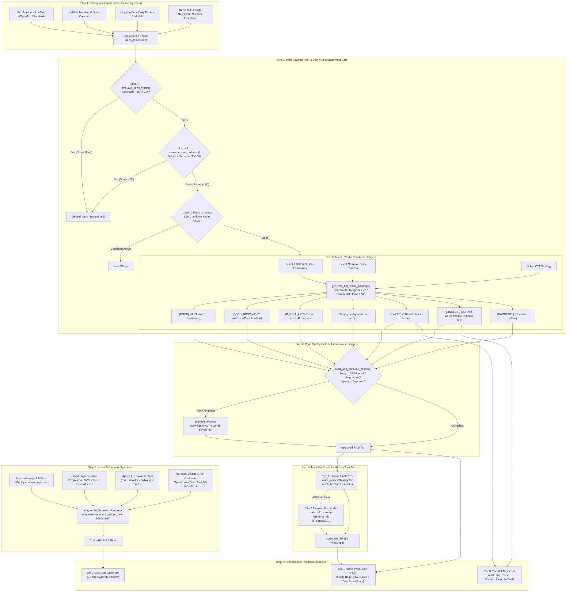

# JAYANT'S AI LAB — END-TO-END SYSTEM WORKFLOW & ARCHITECTURE SPECIFICATION

> **System**: Autonomous AI Content Studio & Intelligence Radar  
> **Brand**: Jayant's AI Lab (`@jayantsailab`)  
> **Location**: South Delhi, India  
> **Target Recipient**: Jayant (`7007116692`)  
> **AI Employee**: Zoro (Voice: `Rasalgethi`, South Delhi tech founder cadence, strictly $\le 30$s audio)

---

## High-Level Architecture Diagram



---

## Step-by-Step Breakdown: What Happens Behind the Scenes

### STEP 1: Intelligence Radar & Ingestion
* **Goal**: Monitor the global AI ecosystem 24/7 without burning API quotas.
* **Sources Polled**:
  - **Reddit**: `r/LocalLLaMA`, `r/OpenAI`, `r/ClaudeAI`, `r/MachineLearning`, `r/ArtificialInteligence` (Reddit JSON feeds).
  - **Hugging Face**: Daily Papers API (`huggingface.co/api/daily_papers`) & Trending Models.
  - **GitHub Trending**: Top Python/AI repositories created or trending in the last 24 hours.
  - **News APIs**: Tavily, NewsData.io, NewsAPI, SerpApi, FreeNewsAPI.
* **Quota Management (`QuotaManager`)**:
  - Tracks daily usage in `api_quota.json`. Enforces hard daily caps (e.g. Tavily: max 25 calls/day, NewsAPI: 80 calls/day) to prevent bill shocks.
* **Deduplication Engine**:
  - Hashes the headline and link into `seen_topics.json`.
  - Topics already processed or published before `AUTOMATION_START_TIME` are skipped.
  - Uses round-robin fair interleaving across categories so one source never dominates.

---

### STEP 2: Multi-Layered Filter & 90% Viral Engagement Prediction Gate
* **Goal**: Completely eliminate notification overload on Telegram. Enforce a **$\ge 90\%$ predicted viral breakout threshold** so only 1 to 3 supreme, high-engagement drops reach Telegram daily.

#### Layer 1: Technical Usability & Freshness Gate (`evaluate_news_worth`)
* **Checks**:
  1. Concrete tool/framework usable by a business owner or solo creator within 24 hours?
  2. Concrete "how it works", not funding rounds, benchmarks, or personnel gossip?
  3. Genuinely new demo/walkthrough?
* **If Failed**: Marked `FILTERED_NOT_USABLE`, logged, and permanently suppressed.

#### Layer 2: 90% Viral Engagement & Breakout Predictor Gate (`evaluate_viral_potential`)
* **Checks**: Evaluates the topic across the **5 Viral Content Pillars** (0–20 points each, 100 points total):
  1. **Shock / Wow Factor (0–20)**: Does it feel like magic or sci-fi? Does it create an instant pattern-interrupt?
  2. **Mass Relatability & Utility (0–20)**: Can non-technical business owners, solo creators, or everyday knowledge workers use it to save hours or make money? (Severely penalizes niche developer-only Python/CUDA scripts).
  3. **Visual Demo Saliency (0–20)**: Can the breakthrough be visually demonstrated in 15–30s or a 7-slide high-contrast carousel?
  4. **Urgency & FOMO (0–20)**: Does not knowing this put the viewer at an operational disadvantage?
  5. **Actionability & Stealability (0–20)**: Can the viewer immediately try the workflow without friction or high costs?
* **Hard Threshold**: Must score $\ge 90/100$ AND receive `viral_verdict: "APPROVE_VIRAL"`.
* **If Score < 90**: Marked `FILTERED_LOW_VIRAL (Score: XX/100)` and **NEVER dispatched to Telegram**.

#### Layer 3: Pacing Cooldown & Daily Frequency Governor (`RadarGovernor`)
* **Cooldown**: Enforces a minimum **2.5-hour interval (9,000 seconds)** between automated radar deliveries.
* **Daily Cap**: Enforces a maximum of **4 automated deliveries per 24 hours**.
* **State Persistence**: Tracked in `radar_governor.json` so cloud restarts never trigger message bursts.
* **Manual Override**: Any topic sent directly by Jayant to Telegram DM bypasses the cooldown and generates instantly on demand.

---

### STEP 3: Chief Scriptwriter Engine (Draft Generation)
* **Goal**: Generate a cohesive, multiplatform viral asset package in one single call.
* **Function**: `generate_full_studio_package(topic_title, topic_details)`
* **Dynamic Hook & Story Selection**:
  - Selects 1 hook framework from the **1,000 Viral Hooks Vault** (`1,000 Viral Hooks (PBL) 2.pdf`).
  - Selects 1 storytelling structure (Hero's Journey, Man in a Hole, Origin Epiphany).
  - Selects 1 CTA strategy (Blueprint Giveaway, Tactical Challenge, Contrarian Debate).
* **LLM Cascade**: OpenRouter DeepSeek V3 $\rightarrow$ Gemini 3.8 Flash $\rightarrow$ Gemini 3.5 Flash Lite $\rightarrow$ Groq 120B.
* **Master Prompt**:
  ```text
  You are the Chief Scriptwriter & Creative Director for Jayant's AI Lab (@jayantsailab)
  in South Delhi. You are producing a complete multi-platform content package for one
  AI breakthrough. Follow every constraint exactly — this output goes straight into
  production with no human editing pass.

  TOPIC: {topic_title}
  DETAILS: {topic_details}
  HOOK FRAMEWORK TO USE: {selected_hook}
  STORY STRUCTURE TO USE: {selected_story_structure}
  CTA STRATEGY TO USE: {selected_cta}

  Produce the following 7 sections in this exact order, each starting with its bracketed
  label on its own line.

  [HOOK]
  - 12 to 22 words total. Count before you finalize.
  - Do not restate the headline. Open with a contrarian or surprising claim from
    Jayant's builder point of view.
  - Must end with a handover to Zoro. Vary the phrasing — do not reuse a stock line
    verbatim across topics. The handover must name Zoro and imply he'll explain the
    mechanics next.

  [ZORO_BODY]
  - Exactly 60 to 75 words. Count before you finalize — if it's outside this range,
    rewrite it, don't just trim the end.
  - Opens with Zoro introducing himself as Jayant's AI employee, in a fresh original
    phrasing each time (do not copy a template line word-for-word).
  - Explains the mechanism using one everyday physical analogy — something a
    12-year-old has directly experienced (a homework notebook, a helper who reads
    fast, an autopilot). The analogy must map to what the tool ACTUALLY does, not
    a generic "it's smart" comparison.
  - Structure: (1) name the boring/slow task this replaces, (2) the analogy for how
    the tool does it, (3) the concrete outcome in time or effort saved.
  - Banned words (reject and rewrite if any appear): deterministic, routing, tokens,
    latency, VRAM, API moat, sub-agent, schema, infrastructure, optimize/optimization,
    leverage, delve, testament, beacon, tapestry, landscape, revolutionize,
    game-changer, unlock, navigate, elevate, harness, moreover.
  - No em dashes (— or --). No stage directions, no parentheticals, no quotation marks
    around the monologue itself.

  [B_ROLL_LIST]
  - 3 to 4 entries. Each entry: a timestamp range in the video (e.g. [00:08-00:20]),
    a one-line description of what's on screen, and a literal prompt written for
    Kling/Luma/Runway (subject, action, camera movement, lighting — no dialogue).

  [CTA]
  - One sentence only. Must ask for a specific action (save, comment, follow) — not
    a vague "check this out."

  [TWEET]
  - 140 to 240 characters. Count before you finalize.
  - Plain builder voice, no corporate framing, no hashtags unless genuinely useful.
  - Never mention "bio" in any form.

  [LINKEDIN]
  - 160 to 240 words. Count before you finalize.
  - Line 1: a problem a founder or non-coder actually has, in their words, not yours.
  - Then: why the manual version of this wastes paid hours (be specific, not "time
    consuming").
  - Then: the 3-step system framed as (1) cut research time, (2) automate the
    repetitive part, (3) a human quality check before anything ships.
  - Then: one concrete number for hours saved per week — must be plausible for
    this specific tool, not a stock "10+ hours."
  - Close: ask to save the post and comment. Never mention "bio."
  - No raw URLs. No markdown formatting characters.

  [CAROUSEL]
  Provide the 6 slide contents in order — each 1-2 lines, ready to drop into a
  template:
  1. Contrarian title hook
  2. The old slow way vs. the agent way (one line each)
  3. How it works under the hood, in one plain-English analogy
  4. Input → Prompt/Model → Output, as a 3-step blueprint
  5. One quantifiable ROI number (hours saved, cost delta, or speedup multiple)
  6. CTA line for saving/following @jayantsailab

  GLOBAL RULES (apply to every section above):
  - No em dashes anywhere.
  - Never use: delve, testament, beacon, tapestry, landscape, revolutionize,
    game-changer, unlock, navigate, elevate, harness, moreover.
  - No phone numbers, ever.
  - Brand is always "Jayant's AI Lab", handle always "@jayantsailab" — never
    abbreviate or alter.
  - Never mention "in bio," "link in bio," or "check bio" — there is no bio link.

  Before finalizing your response, silently re-check: HOOK word count, ZORO_BODY word
  count and banned-word list, TWEET character count, LINKEDIN word count, and the
  em-dash ban across all sections. Fix anything that fails, then output the final
  package only — no notes about what you checked.
  ```

---

### STEP 4: Autonomous Content Quality Monitor (Chief Quality Gate)
* **Goal**: Guarantee 9.9/10 content quality before anything reaches Telegram.
* **Function**: `audit_and_enhance_content(pkg, topic_title, topic_details)`
* **Audits Performed**:
  1. **Avatar Handover Audit**: Verifies hook ends with handoff to Zoro.
  2. **Zoro Intro Audit**: Verifies Zoro introduces himself dynamically as Jayant's AI employee.
  3. **Strict 30s / Word-Count Audit**:
     ```python
     if word_count > 80 or word_count < 55 or has_jargon:
         # Trigger Elevation Prompt
     ```
  4. **Elevation Prompt**:
     ```text
     You are the Chief Quality Monitor for Jayant's AI Lab. A draft script failed
     validation. Rewrite it from scratch — do not patch the existing draft.

     TOPIC: {topic_title}
     DETAILS: {topic_details}
     FAILURE REASON: {reason}
     REJECTED DRAFT (for context only, do not reuse its phrasing): {body}

     Write a new monologue that a 12-year-old could follow on first listen.

     HARD CONSTRAINTS:
     1. Exactly 60 to 75 words. Count before responding. This is the #1 reason drafts
        get rejected — check it twice.
     2. Open with: "{dynamic_intro}" — then continue in the same energetic voice.
     3. One real-experience analogy (homework, a helper who reads fast for you, an
        autopilot) that maps to what this tool actually does — not a generic
        "it's smart" comparison.
     4. Never use: token, velocity, deterministic, VRAM, API moat, latency, vector,
        embedding, infrastructure, optimize, or any corporate/engineering term.
     5. Structure in exactly this order: the boring task everyone hates → the analogy
        for how the tool replaces it → the concrete result in time/effort saved,
        closing on "if you can text on WhatsApp, you can use this today" or an
        equivalent zero-barrier line.
     6. No em dashes. No quotation marks. No stage directions or brackets.

     Return only the final monologue text — no preamble, no word count, no notes.
     ```
  5. **Tweet Scrubber**: Automated regex scrubs any accidental "in bio" phrases and truncates to $\le 250$ chars.
  6. **LinkedIn Scrubber**: Replaces raw links with `"Drop a comment below with your thoughts."`
  7. **Humanizer Pass**: Removes quotes, dashes, and robotic filler.

---

### STEP 5: Multi-Tier Voice Track Synthesis (Zoro Audio)
* **Goal**: Produce crisp, urban Indian English audio for Zoro that matches the Telegram text word-for-word.
* **Timing Guarantee**: Synthesis runs **ONLY AFTER** Step 4 approves the final audited script text.
* **Tier 1: Google Gemini Flash TTS (Primary)**:
  - Model: `gemini-2.5-flash-preview-tts` (or `gemini-3.1-flash-tts-preview`)
  - Voice: `voice_name="Rasalgethi"`
  - Directing Syntax: Official Google AI Studio Director's Notes:
    ```markdown
    ### DIRECTORS NOTES
    Voice: Rasalgethi
    Accent: Indian English accent as heard in South Delhi, India
    Pacing: Fast, energetic, confident tech founder cadence
    Emotion: Clear, enthusiastic

    ### TRANSCRIPT
    [enthusiastic] {clean_text}
    ```
  - Dual Key Failover: `GEMINI_API_KEY_2` $\rightarrow$ `GEMINI_API_KEY`.
* **Tier 2: Fish Audio API (Automatic Failover)**:
  - Triggered if Gemini keys return `429 RESOURCE_EXHAUSTED`.
  - Endpoint: `https://api.fish.audio/v1/tts`
  - Header: `model: s2.1-pro-free`
  - Voice Reference ID: `fb7ec16ca51a45a5a4db881244d7990a`
  - Key: `sk-fish-BeTKz_YUTsBXtwd-LUHDl9M_1Yh3w32btZEa-716cJ4`
* **Duration Guarantee**: Because the script is strictly 60 to 75 words, generated audio is consistently **20 to 25 seconds** (strictly $\le 30$ seconds).

---

### STEP 6: Dynamic Visual Asset Generation & Branding
* **Goal**: Create custom visuals and resolve brand identity without visual repetition.
* **Agnes AI 3D Clay Character Synthesis**:
  - Model: `agnes-image-2.0-flash` (`https://agnes.ai/api/v1/images/generations`)
  - Prompt: `Cute 3D clay character operator for {clean_topic[:50]}, stylized warm lighting, white background, octane 3D render, 8k`
  - Failover: Hugging Face FLUX.1 Schnell (`black-forest-labs/FLUX.1-schnell`).
* **Official Brand Logo Resolver (`get_tool_brand_logo()`)**:
  - Scans topic for 30+ major AI brands (OpenAI, Claude, Anthropic, Google, DeepMind, Mistral, Meta, Midjourney, Rabbit, Hugging Face, GitHub, etc.).
  - Downloads SVG logo from SimpleIcons CDN and renders as vector badge.
* **12-Avatar Agnes AI Specialist Fleet (`assets/avatars/`)**:
  - 12 pre-rendered 3D clay characters (Developer, Robot, Analyst, Coder, Detective, Builder, Creative, Executive, Ninja, Astronaut, Scientist, Growth).
  - Slide 3 randomly samples 6 distinct characters for its 6 cards (zero repetition).
  - Card 1 includes the floating circular official brand logo badge.

---

### STEP 7: Editorial 7-Slide Instagram Carousel Engine
* **Goal**: Generate ultra-crisp 1080x1350 editorial carousel slides modeled after `@theautomationguy.ai`.
* **Prompt**:
  ```text
  [SYSTEM]
  You are the chief design and content director for Jayant's AI Lab (@jayantsailab).
  You generate structured JSON for a 7-slide Instagram carousel in the visual style of
  top tech creators. Output ONLY valid JSON — no markdown fences, no commentary, no
  trailing text before or after the JSON object. If you are unsure a field fits the
  schema, still include it with your best value; never omit a required field.

  [USER]
  TOPIC: {topic_title}
  DETAILS: {topic_details}

  Generate exactly 7 slides in this sequence. Every slide needs high information
  density — no filler sentences, no restating the slide title in the body text.

  1. slideType "hero": titlePrefix, titleOrange (the punchy accent phrase, 2-4 words),
     titleSuffix, a subtitle pill (under 8 words), a terminal box with 4 short
     verified-status items relevant to this specific topic (not generic), and a
     sticky note in a casual handwritten tone (under 12 words).
  2. slideType "org_chart": one leader/orchestrator card, then 4 department cards
     (numbered 01-04) each with a title and a one-sentence description specific to
     how THIS tool's pipeline actually works. Sticky note.
  3. slideType "grid_cards": 6 items (01-06), each with an uppercase 2-3 word tag,
     a title, and one actionable sentence — what a viewer could literally go do.
     Sticky note.
  4. slideType "workflows": 4 practical prompts a viewer could copy-paste today
     (e.g. "Launch a feature sprint"), each with 3-4 concrete bullet tasks. Sticky
     note.
  5. slideType "benchmark": one side-by-side comparison — Old Manual Way vs.
     Jayant's AI Lab Way — with a specific time and cost figure on each side
     (plausible for this topic, not a stock number), plus one bottom-line ROI
     highlight. Sticky note.
  6. slideType "workflows": 4 real day-to-day business use cases for this
     specific tool (not generic AI use cases). Sticky note.
  7. slideType "cta_final": headline "Same Team. A More Capable You.", one clear
     value-proposition sentence, button text "Save This Carousel & Follow
     @jayantsailab", 3 short pills, and a one-line quote sign-off.

  Every slide's content must be specific to {topic_title} — reject any content you
  generate that would still make sense if you swapped in a different topic, and
  regenerate it before including it in your output.

  Return a single JSON object matching this shape:
  {{
    "categoryTag": string,
    "slides": [ {{ "slideType": string, ...fields for that type... }}, ... ]
  }}
  ```
* **JSON Generator**:
  - LLM generates structured 7-slide JSON schema:
    1. **Slide 1 (Hero)**: Hook headline (split into prefix, orange accent, suffix), terminal box with 4 active items, Agnes AI clay artwork, kraft sticky note.
    2. **Slide 2 (Org Chart)**: Zoro Leader card + 4 department fleet cards.
    3. **Slide 3 (Specialist Fleet)**: 6 distinct Agnes AI clay avatar cards with 24px bold titles, 16.5px bold descriptions, and Card 1 floating brand logo.
    4. **Slide 4 (Execution Prompts)**: 4 practical prompts with bullet task checklists.
    5. **Slide 5 (Benchmark)**: Side-by-side comparison (Old Manual Way vs Jayant's AI Lab Way) + 99.4% Time Saved bar.
    6. **Slide 6 (Workflows)**: 4 production business deployment workflows.
    7. **Slide 7 (CTA Final)**: Transformation headline, save button, 3 credibility pills.
* **Rendering Engine**:
  - Headless Chromium via Playwright (`sync_playwright`).
  - Template: `carousel_style_editorial_pro.html`.
  - Viewport: 1080 x 1350 px at `device_scale_factor=2` (renders at 2160x2700 for ultra-sharp mobile feeds).
  - Injects JSON into the DOM via `setSlide(data)` and captures 7 PNGs into `carousel_outputs/`.

---

### STEP 8: Omnichannel Telegram Dispatcher
* **Target Chat**: Jayant's personal Telegram DM (`AUTHORIZED_CHAT_ID = 7007116692`).
* **Bot 1: Video Production Pack Bot (`TELEGRAM_BOT_TOKEN_VIDEO`)**:
  - Delivers formatted markdown message containing:
    - Source link & Headline
    - Your Hook (Google Vids Avatar)
    - Zoro Body Script (Strict 30s / ELI-Kid)
    - Your CTA (Google Vids Avatar)
    - Automated B-Roll scene cues & AI generation prompts
  - Attaches the synthesized Zoro voice track (`.mp3` or `.wav`) with caption: `🎙️ ZORO Audio (Rasalgethi • South Delhi Cadence)`.
* **Bot 2: Carousel Studio Bot (`TELEGRAM_BOT_TOKEN_CAROUSEL`)**:
  - Dispatches the 7 rendered slides as a native swipeable Instagram album (`sendMediaGroup`).
* **Bot 3: Social & News Bot (`TELEGRAM_BOT_TOKEN_SOCIAL`)**:
  - Delivers the $\le 250$ character Tweet.
  - Delivers the complete Claude LinkedIn Skill founder post.
